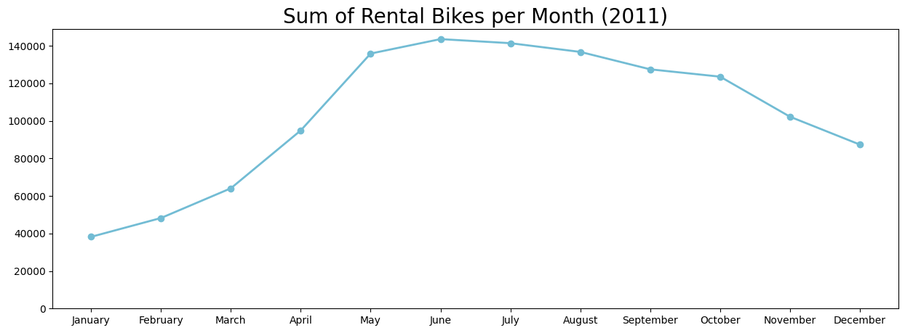
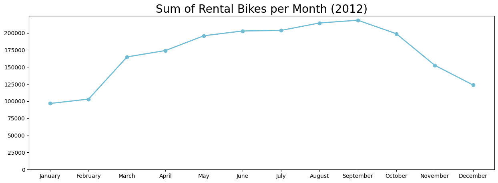
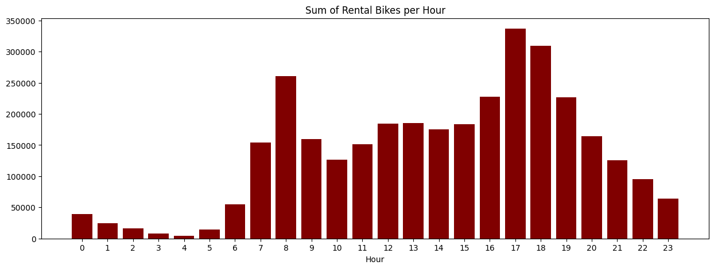
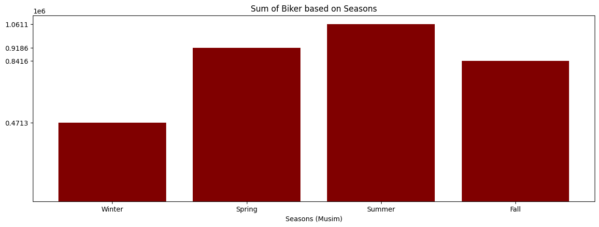
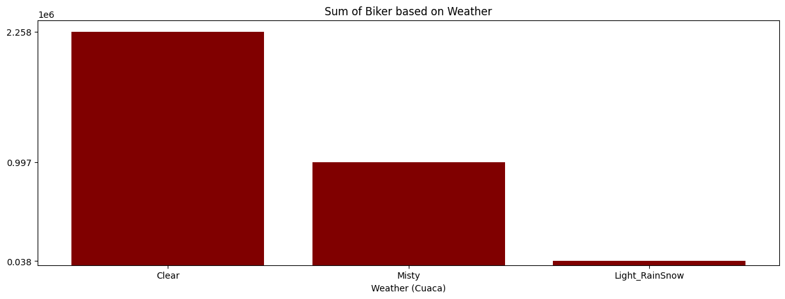

# Analisis Data - Bike-Sharing Rental ✨

## Deskripsi Proyek
Proyek ini merupakan bagian dari assignment course analisis data yang bertujuan untuk memahami pola penyewaan sepeda (bike-sharing rental) berdasarkan berbagai faktor lingkungan dan waktu.
Penyewaan sepeda sangat dipengaruhi oleh kondisi cuaca, musim, hari, dan jam tertentu. Melalui proyek ini, dilakukan analisis data untuk memahami bagaimana faktor-faktor tersebut memengaruhi jumlah peminjaman sepeda serta menyajikannya dalam bentuk dashboard simpel menggunakan Streamlit.

Dataset diambil dari [Kaggle Dataset](https://www.kaggle.com/datasets/ufukyldz/bike-sharing-dataset), dan proses analisis terdiri dari empat langkah yaitu `Data Wrangling`, `Exploratory Data Analysis`, `Visualization dan Explanatory Analysis` serta `Conclusion`. 

> Data terdiri dari 17.379 entri yang di-upload oleh user [Ufuk Yıldız](https://www.kaggle.com/ufukyldz) yang berasal dari catatan historis tahun 2011 dan 2012 dari sistem  Capital Bikeshare system, Washington D.C., USA, yang tersedia secara publik di http://capitalbikeshare.com/system-data. Data diaggregasi berdasarkan jam dan harian serta menambahkan informasi cuaca dan musim yang sesuai.

## Tujuan Analisis

Analisis ini bertujuan untuk menjawab dua pertanyaan utama berikut:
1. Bagaimana perkembangan dari jumlah pengguna tiap tahun, apakah ada peningkatan atau penurunan?
2. Faktor apa yang mempengaruhi jumlah pengguna?

Jawaban atas pertanyaan ini akan diperoleh melalui tahap **Visualization dan Explanatory Analysis** dan dirangkum kembali pada bagian **Conclusion**.

## Dataset
Dataset yang digunakan berisi informasi terkait:
1. Kondisi cuaca (Clear, Misty, Light Rain/Snow, Heavy Rain/Snow)
2. Musim (Spring, Summer, Autumn, Winter)
3. Bulan
4. Jam dalam sehari
5. Jumlah penyewaan sepeda

## Tahapan Analisis

### 1. Data Wrangling
Tahap ini bertujuan untuk menyiapkan data agar siap dianalisis, meliputi:
#### A. Gathering Data
Mengimpor dan memuat dataset Bike-Sharing
#### B. Assesing Data
- Mengecek kesalahan tipe data
- Mengecek nilai null / NaN
- Mengidentifikasi kolom yang tidak relevan
#### C. Cleaning Data
- Mengubah tipe data yang tidak sesuai
- Mengatasi null / NaN value
- Menghapus kolom yang tidak diperlukan
- Menormalisasi nilai temperature, humidity dan wind speed
- Mengubah nilai weather, season dan hari agar lebih mudah dipahami

### 2. Exploratory Data Analysis
- Identifikasi pola penyewaan sepeda
- Analisis hubungan antara variabel waktu, cuaca, dan jumlah rental

EDA digunakan untuk menjawab pertanyaan analisis secara kuantitatif


### 3. Visualization dan Explanatory Analysis
- Mempermudah pemahaman pola data dengan grafik dan visual yang informatif
- Menampilkan tren penyewaan berdasarkan `Jam dalam sehari`, `Musim` dan `Kondisi cuaca`
- Menjawab 2 pertanyaan utama tersebut

## Conclusion
### **1. Bagaimana perkembangan dari jumlah pengguna tiap tahun, apakah ada peningkatan atau penurunan?**
<p align="center">
    
    
</p>


Berdasarkan visual data, bisa dikatakan bahwa **dibandingkan tahun 2011, pada tahun 2012 mengalami kenaikan jumlah penguna Rental Bikes.**

- Bisa dilihat bahwa **pada tahun 2011 jumlah pengguna Rental Bikes terendah berada di kisaran 40.000an orang. Sementara untuk tahun 2012, jumlah pengguna Rental Bikes berada di kisaran 100.000an orang.**

- Bisa dilihat juga **pada tahun 2011 jumlah pengguna Rental Bikes tertinggi berada di kisaran 140.000an orang. Sementraa untuk tahun 2012, berada di kisaran 200.000 lebih orang**

### **2. Faktor apa yang mempengaruhi jumlah pengguna?**
Terdapat beberapa faktor yang memengaruhi jumlah pengguna, yaitu :

#### 1. Jam
<p align="center">
    
</p>

Berdasarkan visual data, **Pada jam 8 Pagi dan kisaran waktu 5-6 Sore adalah waktu tertinggi** dimana biasanya para customer menggunakan **Rental Bikes**.
Dimana **pada kisaran 0-5 Pagi adalah waktu terendah**. Ini dikarenakan waktu tersebut adalah dimana **waktu tidur/istirahat**


#### 2. Season (Musim)
<p align="center">
    
</p>

Berdasarkan visual data, **pada saat Summer (Panas) adalah musim tertinggi untuk jumlah pengguna Rental Bikes**. Namun untuk **musim Spring (Semi) dan Fall (Gugur), jumlah penggunanya tidak terlalu jauh dari jumlah pengguna pada Summer (Panas).**
Sementara untuk **Winter, memiliki jumlah pengguna yang sangat jauh dibandingkan dengan ketiga musim yang lain**. Hal ini bisa terjadi karena berhubungan dengan faktor selanjutnya.

#### 3. Weather (Cuaca)
<p align="center">
    
</p>

Berdasarkan visual data, **mayoritas, orang-orang akan menggunakan Rental Bikes disaat cuaca Clear (Cerah).**
Bisa dilihat untuk cuaca yang lain, memiliki jumlah pengguna **Rental Bikes** yang sangat jauh **dibandingkan saat cuaca sedang Clear (Cerah)**.
Bahkan untuk **kategori cuaca Heavy Rainsnow sampai tidak ada sama sekali orang** yang menggunakan Rental Bikes.

## Dashboard
Sebagai pelengkap analisis, proyek ini juga dilengkapi dengan dashboard simpel berbasis Streamlit yang menampilkan:
- Visualisasi yang secara langsung menjawab dua pertanyaan analisis utama
- Grafik peminjaman sepeda berdasarkan bulan pada kedua tahun
- Bar Chart yang menunjukan pengaruh jam, cuaca dan musim terhadap jumlah peminjaman


## Tools & Library
- Google Colab
- python==3.11.2
- numpy==1.26.1
- panda==2.1.3
- matplotlib==3.8.2
- seaborn==0.13.2
- streamlit==1.31.1

## Setup Environment
```
conda create --name main-ds python=3.9
conda activate main-ds
pip install numpy pandas scipy matplotlib seaborn jupyter streamlit
```
## Run steamlit app
```
streamlit run dashboard.py
```

